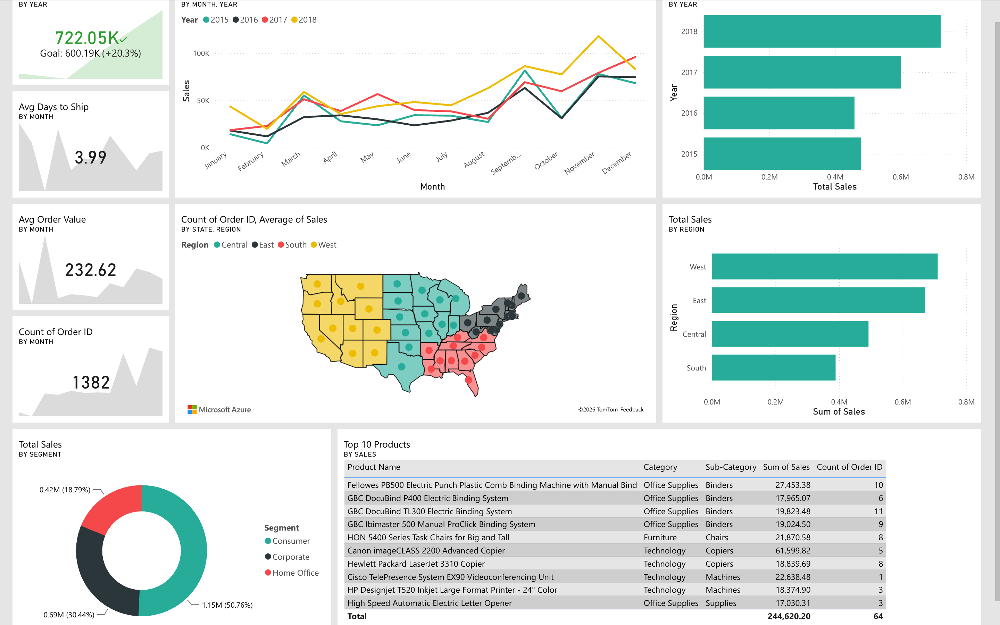
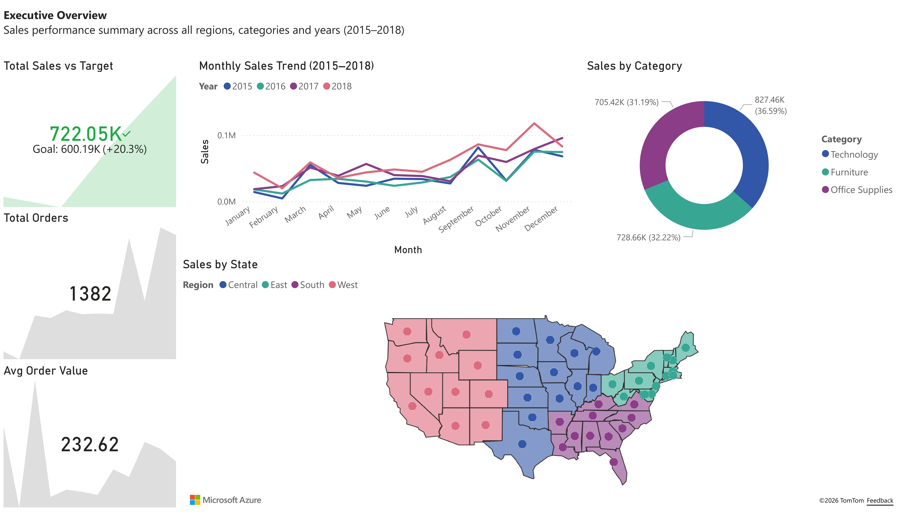
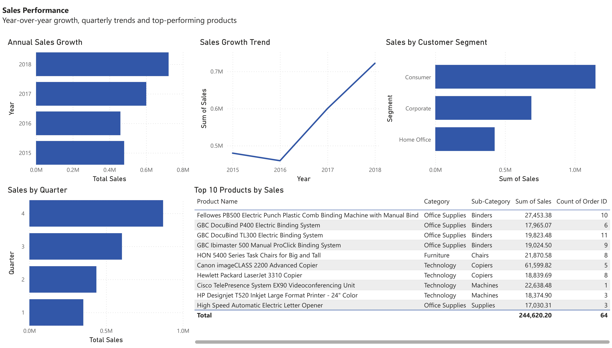
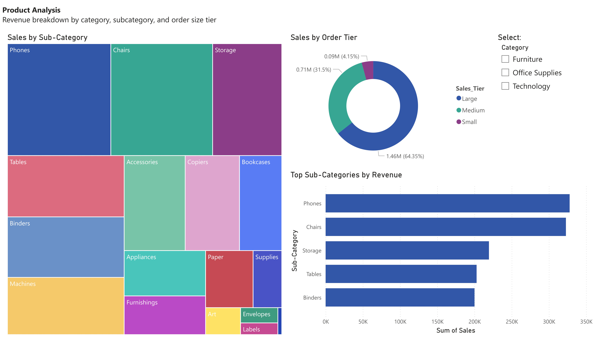
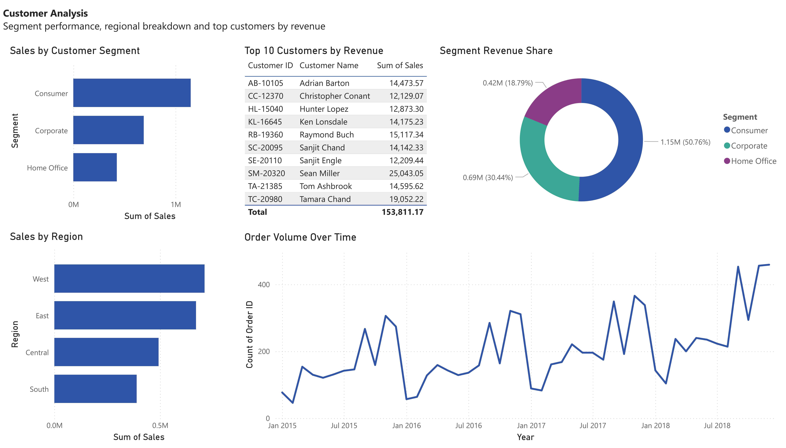
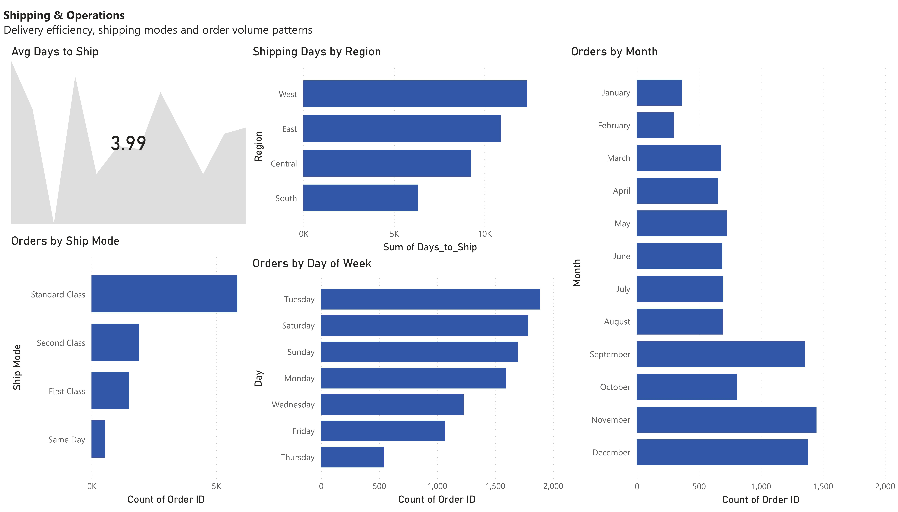

# Superstore Sales Dashboard

An end-to-end data analytics project using Python for data cleaning 
and Power BI for interactive dashboard reporting.



---

## Tools & Technologies
- **Python** (pandas) — data cleaning & feature engineering
- **Jupyter Notebook** — documented analysis workflow
- **Power BI Service** — interactive dashboard & report pages

---

## Dataset
- **Source:** Kaggle — Superstore Sales Dataset
- **Rows:** 9,800 order line items
- **Period:** January 2015 – December 2018
- **Columns:** 18 original + 5 engineered features

---

## Data Preparation (Python)
Full cleaning notebook in `/notebooks`

**Issues fixed:**
- Date parsing bug — dates were in DD/MM/YYYY format but 
  read as MM/DD/YYYY, causing 1,684 rows with negative 
  shipping days
- Resolved by re-parsing with `dayfirst=True`

**Features engineered:**
| Feature | Description |
|---|---|
| `Days_to_Ship` | Difference between Ship Date and Order Date |
| `Sales_Tier` | Small / Medium / Large based on order value |
| `Month` | Extracted from Order Date |
| `Quarter` | Extracted from Order Date |
| `Year` | Extracted from Order Date |

---

## Dashboard Pages

### Page 1 — Executive Overview
KPI cards, monthly sales trend (2015–2018), 
category split and geographic sales map



### Page 2 — Sales Performance
Year-over-year growth, quarterly trends, 
segment breakdown and top 10 products



### Page 3 — Product Analysis
Sub-category treemap, order tier distribution 
and top sub-categories by revenue



### Page 4 — Customer Analysis
Segment performance, regional breakdown, 
top 10 customers and order volume over time



### Page 5 — Shipping & Operations
Average days to ship, ship mode breakdown, 
orders by day of week and monthly order patterns



---

## Key DAX Measures
```dax
-- Current year sales
CurrentSale = CALCULATE(SUM('clean_data'[Sales]),
    YEAR('clean_data'[Order Date]) = MAX(YEAR('clean_data'[Order Date])))

-- Target (previous year)
TargetSale = CALCULATE(SUM('clean_data'[Sales]),
    YEAR('clean_data'[Order Date]) = MAX(YEAR('clean_data'[Order Date]))-1)

-- Total unique orders
Total Orders = DISTINCTCOUNT('clean_data'[Order ID])
```

---

## Key Insights
- **2018** was the strongest year with **$722K** in sales, 
  up **20.3%** from 2017
- **Technology** is the highest revenue category at **36.59%** 
  of total sales
- **West region** leads in sales volume across all 4 years
- **Average shipping time** is **3.99 days** across all orders
- **Q4** consistently outperforms all other quarters 
  driven by November and December spikes
- **Consumer segment** accounts for **50.76%** of all revenue

---

## How to View
**Live Dashboard:** [View on Power BI](#)